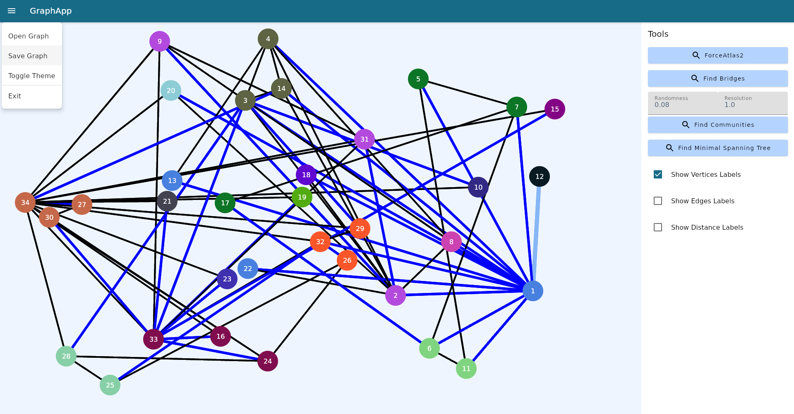

  

<!-- ABOUT THE PROJECT -->
## GraphApp

Представляем наше приложение для работы с графами.
В нём представлены следующие возможности:
1. Визуализация графа, возможность масштабирования и навигации (в разработке)
2. Работа с 4 типами графов, в том числе направленными/ненаправленными и взвешенными/невзвешенными
3. Сохранение и чтение файлов в формате JSON
4. ForceAtlas2 - силовая модель раскладки графа (в разработке)
5. Поиск сообществ
6. Поиск мостов
7. Поиск минимального остова
8. Поиск компонент сильной связности

<!-- LICENSE -->
## Лицензия

Приложение распространяется под MIT License. Смотрите `LICENSE.txt` для большей информации.

<!-- ACKNOWLEDGMENTS -->
## Источники

* [На чём основан наш графический интерфейс](https://github.com/spbu-coding-2023/gui-workshop?tab=readme-ov-file)
* [Статья про ForceAtlas2](https://journals.plos.org/plosone/article%3Fid=10.1371/journal.pone.0098679)
* [Статья на хабре про алгоритм Прима(и не только)](https://habr.com/ru/articles/569444/)
